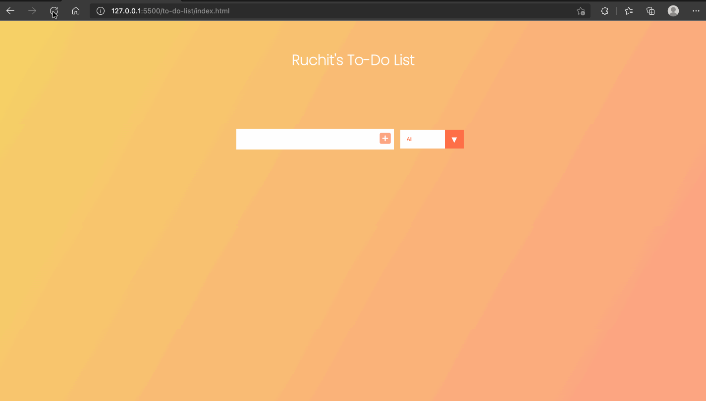

## Todo List

Visit [here](/to-do-list) to view the source code

### Working Video

### Features

- Add todo list items
- Delete todo list items
- Mark completed items
- Filter todo list items based on whether they are completed or not
- Todo list items are saved on browser refresh as well

### Scope for Improvement

- The state of a todo-list item is not stored in the local storage, which can be implemented
