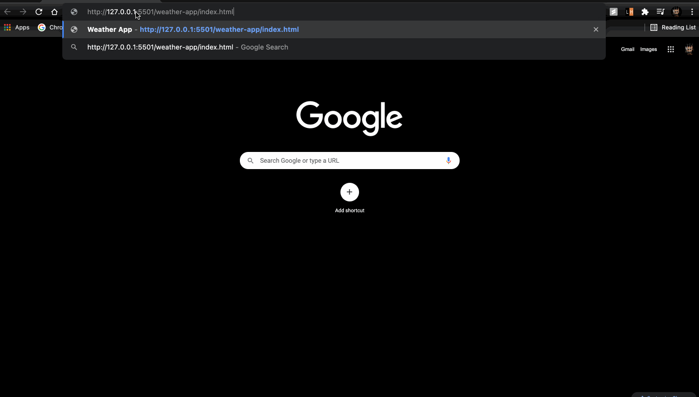

## Weather App

Visit [here](/weather-app) to view the source code

### Working Video

### Features

- Fetch weather data from [DarkSky](https://darksky.net/dev) API. Note that this API is now only available to existing users
- Convert temperature from celsius to fahrenheit on click
- Loader is displayed until we get the response from the API
- [Skycons](https://darkskyapp.github.io/skycons/) are used for animated weather icons

### Scope for Improvement

- The API returns huge amount of data which can be incorporated into the application
